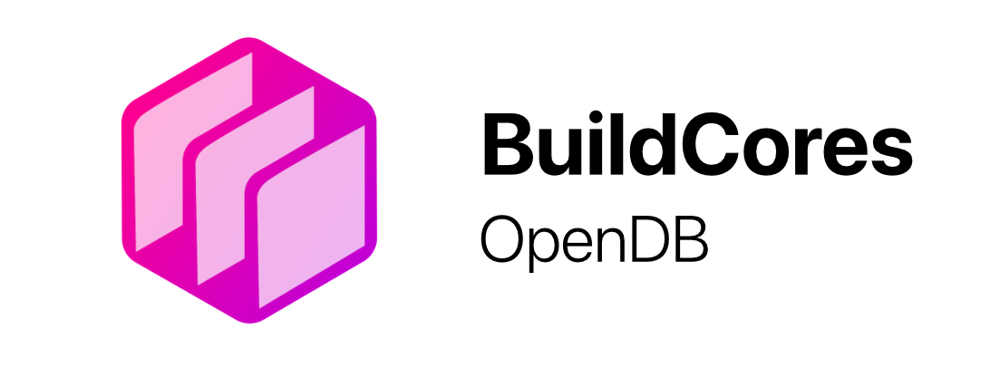

# BuildCores OpenDB
    
A community-driven open database for PC components. This repository contains structured data about computer hardware components that can be used for compatibility checking, component research, and building PC builder / part picking apps.

*For an easy way to browse and search all components in a user-friendly interface, you can visit:*
https://buildcores.com/products

*You can click on the 'Edit in OpenDB' button on each part to open the GitHub page for it*


## Help Wanted / Bounties

We have a few near-term goals for this project to improve data quality and increase the utility of BuildCores (or any other project that relies on this data). 

- We want to collect manufacturer product page urls for each product in our database.
- We want to collect PDFs for each product in our database.
  - Good examples are motherboard and case manuals. We can extract useful information out of these.
- We want to collect motherboard BIOS versioning data along with CPU support lists.
- We want to expand our retailer coverage outside of the USA.
- ... more to come. If you have any specific requests from this project, please open a GitHub issue. 
 

## Repository Structure

- `/open-db/` - Contains component data organized by category (CPU, GPU, RAM, etc.)
- `/schemas/` - JSON schemas that define the structure and validation rules for each component type
- `/.github/workflows/` - Workflows to validate schemas and sync with our internal API

## How to Use

### Accessing Component Data

All component data is stored in the `/open-db/` directory, organized by component category. Each component is stored as a separate JSON file with a UUID v4 filename.

```
/open-db/
  /CPU/
    e0230286-0549-4da9-8115-9d1fbdcc2979.json
    ...
  /GPU/
    ...
  /RAM/
    ...
```

Each product page on the BuildCores website has an "Edit on GitHub" button that allows you to directly contribute changes to the specific component, making it easy to update or fix information.

### Data Structure

Each component follows a standard JSON structure defined by its corresponding schema in the `/schemas/` directory. For example, a CPU component contains information about:

- Core counts and threading
- Clock speeds
- Cache sizes
- Socket type
- TDP
- Integrated graphics (if applicable)
- Retailer SKUs

## How to Contribute

### Adding or Updating Components

1. **Fork the repository** and create a new branch for your changes
2. **Add or modify component JSON files** in the appropriate category directory
   - For new components, create a new JSON file with a UUID v4 filename and include this same UUID in the `opendb_id` field
   - For existing components, modify the component's JSON file
3. **Validate your changes** against the appropriate schema
4. **Submit a pull request** with your changes

### PR Validation

When you submit a pull request, GitHub Actions will automatically:
1. Validate your JSON files against the appropriate schemas
2. Post validation results as a comment on your PR
3. Block merging if validation fails

### After Merge

When changes are merged to the main branch, they are automatically synchronized with the BuildCores API:
- New components are created in the database
- Modified components are updated
- Deleted components are removed

### Component Requirements

- All components must follow the schema for their category
- Required fields vary by component type (check the schema)
- When possible, include retailer SKUs and manufacturer information

## Limitations
We cannot provide price data or retailer-specific data due to restrictions.  

## License

This database is made available under the Open Data Commons Attribution License (ODC-By) v1.0.

You are free:

- To share: To copy, distribute and use the database.
- To create: To produce works from the database.
- To adapt: To modify, transform and build upon the database.

As long as you:

- Attribute: You must attribute any public use of the database, or works produced from the database, in the manner specified in the license. For any use or redistribution of the database, or works produced from it, you must make clear to others the license of the database and keep intact any notices on the original database.

For more information, see [opendatacommons.org/licenses/by/1-0](https://opendatacommons.org/licenses/by/1-0/).
